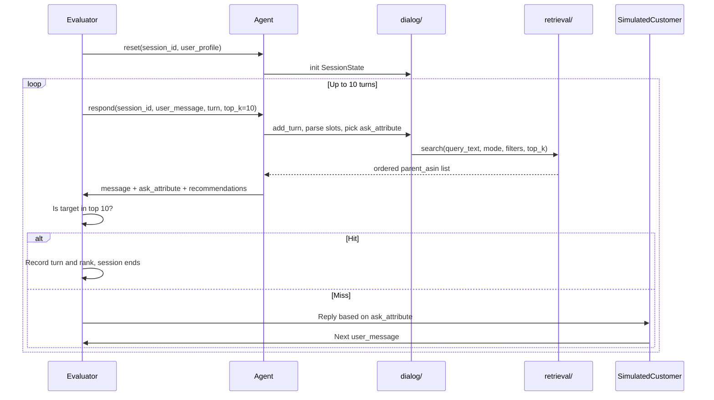

# TechJam Doom-Scrollers — Agent Architecture

Team architecture guide and Cursor AI coding reference for the TechJam 2026 Conversational E-Commerce Search challenge.

---

## 1. Project Overview

We are building a **multi-turn shopping agent** that helps a simulated customer find a hidden target product from a frozen catalog of 50,000 Amazon `Clothing_Shoes_and_Jewelry` items. The evaluator runs up to **10 turns** per session; our agent must return ranked product recommendations and structured clarification questions each turn. A session ends when the target `parent_asin` appears in our top-10 list, or after turn 10.

**Goal:** Maximize **TechnicalScore** by finding the target early and ranking it highly.

**Baseline to beat:** TechnicalScore **0.1067** (Hit Rate@10 0.125, MRR 0.068, MTTC 9.81) — see [docs/baseline_results.json](docs/baseline_results.json).

**Stack:** Python 3.10+, in-memory catalog only, **no LLM API required**. Optional local embeddings (`sentence-transformers`) only as a Day 3 bonus if ahead of schedule.

---

## 2. Team Ownership (Pillar Split)

| Owner | Module | Responsibility |
|-------|--------|----------------|
| Joseph | `starter/retrieval/` | **Pillar I:** BM25 index, metadata filters, buying/browsing retrieval paths, heuristic rerank |
| JY | `starter/agent.py` | **Pillar II:** session state, slot parsing, `ask_attribute` policy, intent override, boundary handling |
| Both | `starter/personalization/` | **Pillar III:** profile signals, context distillation hooks, adaptive question priority |
| Both | `evaluator/` (read-only) | **Pillar IV:** measure Coverage / Precision / Efficiency via local evaluator |

Full pillar notes: [docs/pillars.md](docs/pillars.md)

**Integration rule:** Retrieval and dialog logic stay in their modules; `agent.py` wires them together.

---

## 3. End-to-End Workflow



### Critical rule

**`recommendations` and `ask_attribute` are independent.** Every turn must return up to 10 product IDs *and* optionally ask a clarifying question. Asking does not replace guessing — the session can end on any turn if the target appears in the list.

The evaluator **does not score** the natural-language `message` field. It only checks product IDs and uses `ask_attribute` to decide what the simulated customer reveals next.

---

## 4. Required API Contract

Our submission must export `Agent` with exactly this interface. Full schema: [docs/agent_api_contract.json](docs/agent_api_contract.json).

```python
class Agent:
    def reset(self, session_id: str, user_profile: dict) -> None:
        """Called once per session. user_profile is anonymized aggregate data."""
        ...

    def respond(
        self,
        session_id: str,
        user_message: str,
        turn: int,       # 1–10
        top_k: int,      # always 10
    ) -> dict:
        return {
            "message": "Do you have a material preference?",
            "ask_attribute": "material",  # or null, or one of the allowed values below
            "recommendations": [
                {"parent_asin": "B000..."},
                {"parent_asin": "B001..."},
            ],
            "usage": {"prompt_tokens": 0, "completion_tokens": 0},
        }
```

### `ask_attribute` allowed values

`category`, `material`, `color`, `size`, `style`, `brand`, `budget`, `feature`, `use_case`, `other`, or `null`.

When `ask_attribute` is `null`, the simulated customer gives a useless reply and reveals no new constraints. **Never leave it null intentionally.**

### `user_profile` fields (from `reset`)

```json
{
  "purchase_frequency": "string",
  "average_prior_rating": "number | null",
  "rating_style": "string",
  "preference_tags": ["fit", "comfort", "material"],
  "summary": "string"
}
```

Profile signal is weak for retrieval; prioritize dialog-derived constraints over profile tags.

---

## 5. Internal Interface (Dialog ↔ Retrieval Handoff)

Agreed contract between partner (dialog) and you (retrieval). Implement in `retrieval/search.py`:

```python
def search(
    query_text: str,
    mode: str,
    filters: dict,
    top_k: int = 10,
) -> list[str]:
    """Return ordered parent_asin list, best first."""
    ...
```

### Who produces what

| Field | Producer | Description |
|-------|----------|-------------|
| `query_text` | `dialog/` (`build_query()`) | All accumulated constraint text + history, minus simulator boilerplate |
| `mode` | `dialog/` | `"buying"` or `"browsing"`, detected from first message |
| `filters` | `dialog/` (`to_filters()`) | Structured slots for metadata pre-filtering |
| Return value | `retrieval/` | Ordered list of catalog-valid `parent_asin` strings |

### `filters` shape (example)

```python
{
    "material": ["cotton", "leather upper"],
    "color": ["blue"],
    "max_price": 49.0,
    "category_tokens": ["running", "shoes"],
}
```

Empty `{}` is valid on turn 1 — retrieval should still return broad matches.

### `mode` behavior

| Mode | Detection signal | Retrieval strategy |
|------|------------------|---------------------|
| `buying` | `"key requirement is:"` in first message | Filter-first → AND-heavy BM25 → strict rerank |
| `browsing` | `"still exploring"` in first message | Broad OR-heavy BM25 → light metadata boost |

---

## 6. Official Hackathon Pillars (I–IV)

See [docs/pillars.md](docs/pillars.md) for full notes. Summary:

| Pillar | Official name | Our implementation |
|--------|---------------|-------------------|
| **I** | Multi-Route Retrieval → Ranking | `starter/retrieval/` — HybridSearcher, BM25, filters, reranker |
| **II** | Dynamic State Machine | `starter/agent.py` — slots, intent routing, override/boundary, `ask_attribute` |
| **III** | Self-Evolution: Dynamic Context Programming | History + profile distillation; feedback loop; `starter/personalization/` |
| **IV** | Evaluation Matrix (Coverage / Precision / Efficiency) | Hit Rate@10, MRR, MTTC via `python3 -m evaluator.local_evaluator` |

### Pillar III in one loop

Each turn: accumulate history → distil into search context → retrieve → read `retrieval_feedback` → adapt next question (profile-adjusted priority). Strategy switches on buying/browsing and intent override.

### Pillar IV metric weights

```text
TechnicalScore = 0.50 × HitRate@10 + 0.30 × MRR + 0.20 × Efficiency
```

Optimize **Coverage first** (50% weight), then **Precision** (MRR), then **Efficiency** (MTTC).

### What we are NOT building (3-day scope)

- Paid LLM API calls or full model fine-tuning
- External vector DB clusters (Pinecone, Milvus, etc.)
- UI/frontend
- Cross-session persistent memory beyond per-session `user_profile`

---

## 7. Scenario Types (Evaluator Behavior)

The evaluator simulates four session types. Design and tune for each — see [evaluator/local_evaluator.py](evaluator/local_evaluator.py).

| Scenario | Share | Opening behavior | What we must handle |
|----------|-------|------------------|---------------------|
| **buying** | 40% | Discloses one hard constraint immediately | Filter-first retrieval; AND-heavy query |
| **browsing** | 40% | Vague: "still exploring" | Must ask questions early (`ask_attribute="other"` on turn 1) |
| **intent_override** | 15% | Opens with soft preference; pivots turn 3–4 | Detect "Actually, ignore…"; reset slots; hits before pivot don't count |
| **boundary** | 5% | Refuses first attribute asked | Track refusal; don't re-ask same attribute |

### How the simulator reveals information

The customer only discloses constraints when we set `ask_attribute`. Revealed text is **verbatim catalog metadata** (features, details, price) from the hidden target product — not paraphrased natural language. Design retrieval to match exact constraint phrases.

---

## 8. Scoring (What to Optimize)

```text
HitRate@10  = sessions where target found in top 10 / N
MRR         = mean of 1/rank (miss = 0)
MTTC        = mean first-hit turn (miss = 11)
Efficiency  = clip((11 - MTTC) / 10, 0, 1)
TechnicalScore = 0.50 × HitRate@10 + 0.30 × MRR + 0.20 × Efficiency
```

TechnicalScore feeds into the **Technical Execution** judging criterion (35%) but is not the entire score. Innovation, Impact, and Feasibility matter too.

### Run local evaluation

```bash
python3 -m evaluator.local_evaluator
```

Output: aggregate metrics to stdout; full per-session breakdown in `results.json`. Check `scenario_metrics` after every significant change.

### Score targets

| Metric (Pillar IV) | Baseline | Pillar III | Current (tuned) | Stretch |
|--------|----------|------------|-----------------|---------|
| Hit Rate@10 (Coverage) | 0.125 | 0.855 | **1.000** | 1.00 |
| MRR (Precision) | 0.068 | 0.567 | **0.817** | ≥ 0.85 |
| MTTC (Efficiency) | 9.81 | 4.21 | **2.06** | ≤ 2.0 |
| TechnicalScore | 0.107 | 0.733 | **0.924** | ≥ 0.93 |

Per scenario at 0.9239: browsing 1.000 hit / 0.781 MRR, buying **1.000** / 0.809,
intent_override 1.000 / 0.874, boundary 1.000 / 1.000. **Zero misses** on the public set.
MRR remains the binding constraint — 55 hits still land at rank 2–10.

### Tuning tools

```bash
python3 scripts/score.py mylabel   # one run, compact metrics + rank/turn histograms
python3 scripts/sweep.py           # in-process weight grid, reuses one catalog index
```

`sweep.py` monkey-patches module constants and reuses a single `Agent`, so a configuration
costs ~8s instead of a full index rebuild. Edit its `GRID` to choose knobs.

### Manual testing (not just the evaluator)

```bash
# Unit tests (components)
python3 -m unittest tests.test_retrieval tests.test_personalization tests.test_agent_routing -v

# Full 200-session benchmark (Pillar IV)
python3 -m evaluator.local_evaluator
```

Interactive demo and single-session replay patterns: [docs/pillars.md](docs/pillars.md#manual-testing-beyond-the-evaluator).

---

## 9. File Layout (current)

```text
starter/
  agent.py                      Pillar II + III orchestration
  retrieval/                    Pillar I (HybridSearcher, BM25, filters, reranker, feedback)
  personalization/              Pillar III (profile_signals, rerank_boost, question_priority)
scripts/
  score.py                      One evaluation run, compact metrics
  sweep.py                      Weight grid sweep over a shared catalog index
tests/
  test_retrieval.py
  test_personalization.py
  test_agent_routing.py
  test_evaluator.py
docs/
  pillars.md                    Official Pillar I–IV notes + improvement matrix
  tuning_log.md                 What moved the score, and what did not
evaluator/local_evaluator.py    Pillar IV scorer (do not edit)
```

**Do not edit:** `evaluator/`, `data/public_set.jsonl`, organizer files.

---

## 10. Differentiation Narrative (Devpost / Judging)

Use this framing when writing Devpost or presenting:

**Problem:** Traditional keyword search fails when customer intent emerges over multiple turns. The first message often carries almost no product-specific signal (especially in browsing sessions).

**Our insight:** The evaluator's simulated customer reveals **catalog-aligned constraint text** when asked structured questions (`ask_attribute`). Retrieval should optimize for progressive constraint narrowing, not one-shot query understanding.

**Why our approach matters:**

1. **Simulator-aware retrieval (Pillar I)** — reranking boosts exact phrase overlap with disclosed constraints, plus a category-path signal that is guaranteed true for the target.
2. **Recall-first retrieval, precision in the reranker (Pillar I + II)** — buying attempts a strict conjunctive pass and falls back to broad recall. We measured that narrowing candidates with hard Boolean constraints loses more targets than it gains rank on, so precision lives in the reranker instead. See [docs/tuning_log.md](docs/tuning_log.md).
3. **Dynamic context programming (Pillar III)** — dialog history + profile distil into search context each turn; retrieval feedback adapts clarification strategy.
4. **Evaluation-driven tuning (Pillar IV)** — optimize Coverage (Hit Rate), Precision (MRR), Efficiency (MTTC) on the public matrix.
5. **Offline-first** — no API keys, in-memory only.

**Honest positioning:** Many teams will use similar building blocks. Our edge is deliberate design for this task's information-revelation model, not the algorithm name.

---

## 11. Cursor AI Coding Rules

When an AI assistant edits this repo, follow these rules:

### Must not

- Edit `evaluator/` or `data/public_set.jsonl`
- Commit API keys or secrets (use environment variables if LLM added later)
- Import from `evaluator/` in starter code (copy regex patterns into `dialog/` if needed)
- Put business logic in `agent.py` beyond thin orchestration (~40 lines)

### Must do

- Keep `Agent.reset` and `Agent.respond` matching the API contract exactly
- Return valid response shape every turn; handle exceptions gracefully (evaluator treats crashes as empty turns)
- Always return recommendations when the catalog has matches — never skip guessing because you're asking a question
- Set `ask_attribute` to a non-null value unless all attributes are exhausted
- Run `python3 -m evaluator.local_evaluator` after significant retrieval or dialog changes
- Use type hints and `from __future__ import annotations` (match existing style)

### Dependencies

- **Default:** Python stdlib only (sqlite3 FTS5 for BM25)
- **Optional Day 3 bonus:** `sentence-transformers` + `torch` for local dense retrieval — only if lightweight path already beats baseline targets

### Module boundaries

- `dialog/` must not contain BM25 or catalog indexing logic
- `retrieval/` must not contain `ask_attribute` selection or session history logic
- Pass data between modules via the `search(query_text, mode, filters, top_k)` interface only

---

## 12. Commands and References

### Commands

```bash
# Run local evaluator (requires data/catalog.jsonl)
python3 -m evaluator.local_evaluator

# Run unit tests
python3 -m unittest tests.test_retrieval tests.test_personalization tests.test_agent_routing tests.test_evaluator
```

### Key files

| File | Purpose |
|------|---------|
| [docs/competition_specification.md](docs/competition_specification.md) | Full competition rules |
| [docs/agent_api_contract.json](docs/agent_api_contract.json) | Machine-readable API schema |
| [docs/evaluation_config.json](docs/evaluation_config.json) | Scoring weights and limits |
| [docs/baseline_results.json](docs/baseline_results.json) | Reproducible weak-starter reference |
| [docs/submission_rules.md](docs/submission_rules.md) | Submission requirements |
| [README.md](README.md) | Setup, catalog download, installation |

### Catalog setup

```bash
gzip -dk catalog.jsonl.gz
mv catalog.jsonl data/catalog.jsonl
```

Verify with SHA256SUMS from the GitHub Release.

---

## Appendix: Target `respond()` Flow (Day 2+)

```python
def respond(self, session_id, user_message, turn, top_k):
    state = self._sessions[session_id]
    state.add_turn(user_message, turn)
    if state.is_override(user_message):
        state.apply_override(user_message)
    if state.is_boundary_refusal(user_message):
        state.record_refusal(user_message)
    state.slots = self._slot_parser.update(state.slots, user_message)
    ask = self._question_policy.next(state)
    query = state.build_query()
    asins = self._searcher.search(query, state.mode, state.to_filters(), top_k)
    return {
        "message": self._message_for(ask),
        "ask_attribute": ask,
        "recommendations": [{"parent_asin": a} for a in asins],
        "usage": {"prompt_tokens": 0, "completion_tokens": 0},
    }
```

This file is **team + AI reference only**. Setup instructions and submission details remain in [README.md](README.md).
